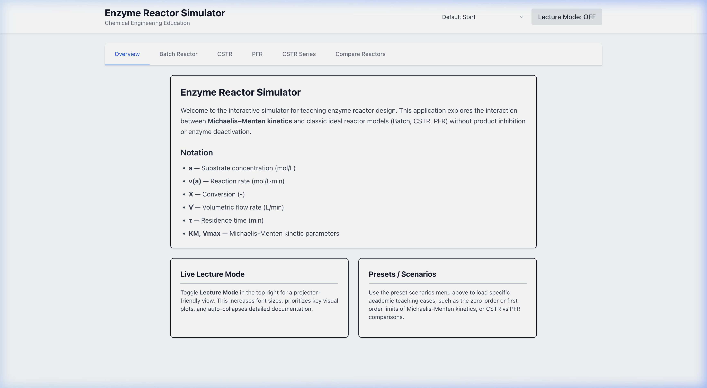
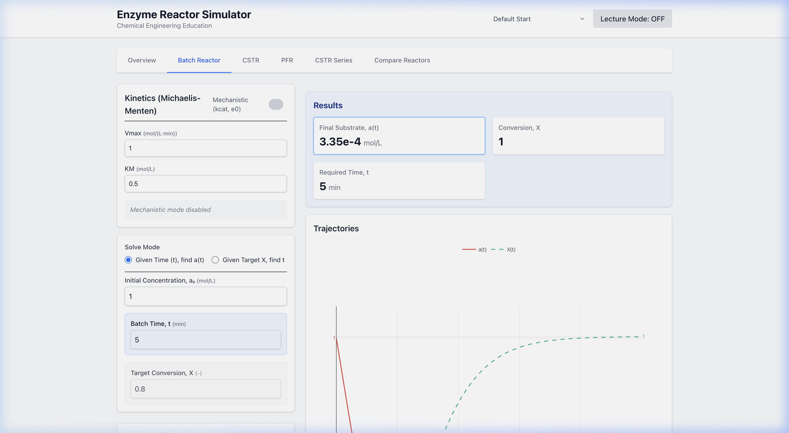
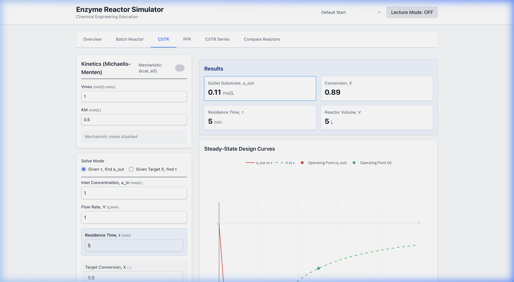
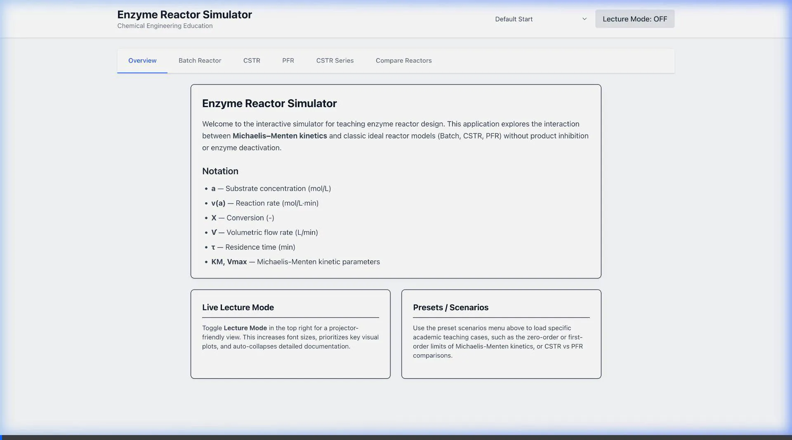

# Phase 2 Verification — Enzyme Reactor Simulator

## What was done

All Phase 2 UI components are implemented and verified working:

- **Overview Tab** — Notation reference, desktop-first layout guidance, Presets info
- **Batch Reactor Tab** — Kinetic inputs, forward/inverse solve modes, a(t) & X(t) trajectory plots
- **CSTR Tab** — a_out vs τ design curves, operating point markers, forward/inverse solve
- **PFR Tab** — a_out vs τ design curves, operating point markers, forward/inverse solve
- **Presets** — Dropdown loads different kinetic scenarios

## Key Bug Fix

The app crashed with `TypeError: createPlotlyComponent is not a function` when navigating to any reactor tab.

**Root cause:** CJS/ESM interop issue — `react-plotly.js/factory` exports via `module.exports` (CJS), but Vite wraps it in a default export. The fix uses the `.default || module` fallback pattern in all 4 Plotly-importing files.

Additionally, `React.lazy()` was added for the heavy Plotly-dependent tabs to prevent blocking the initial render.

## Verified Screenshots

````carousel

<!-- slide -->

<!-- slide -->

````

## Browser Recording



## Next Steps

- **Phase 3:** CSTR Series tab
- **Phase 4:** Comparison tab + Levenspiel plot  
- **Phase 5:** Polish, presets wiring, validation
